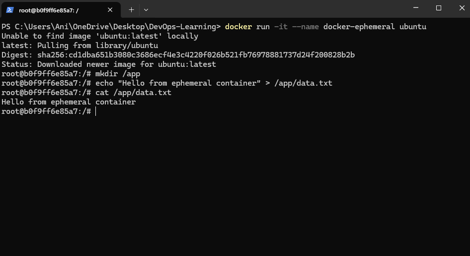
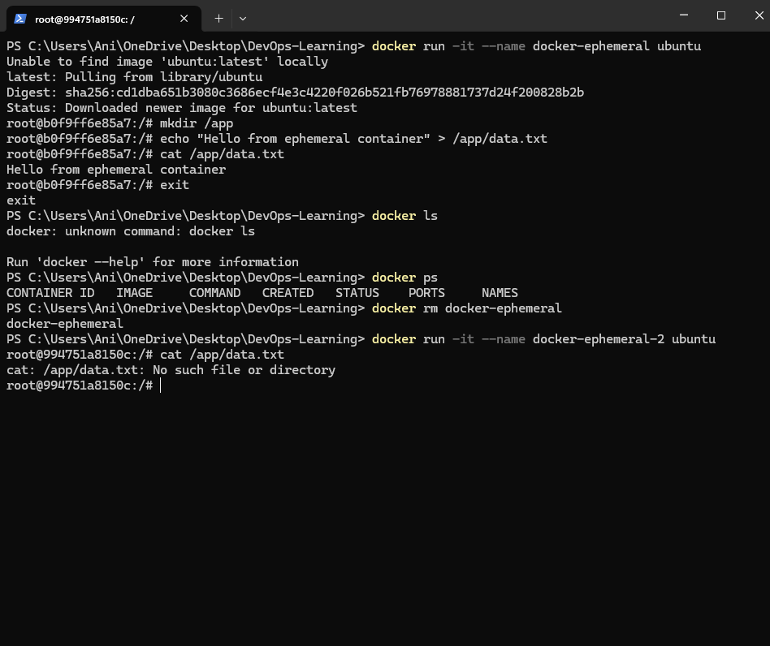

## LAB-1: Ephemeral Container Filesystem (Data Loss)

In this lab, we prove that data written inside a container is lost once the container is removed.

### Steps
1. Started an Ubuntu container.
2. Created a file inside `/app`.
3. Removed the container.
4. Started a new container and attempted to read the file.

### Result
The file was missing after container recreation, proving that the container filesystem is ephemeral.

**Evidence:**  
  

